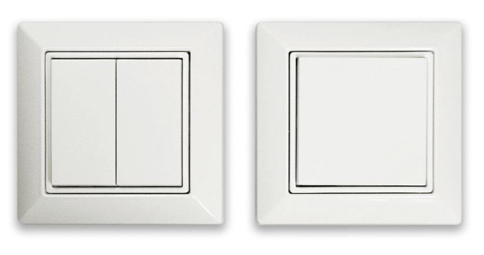
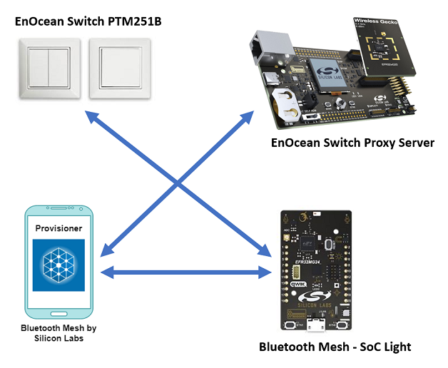
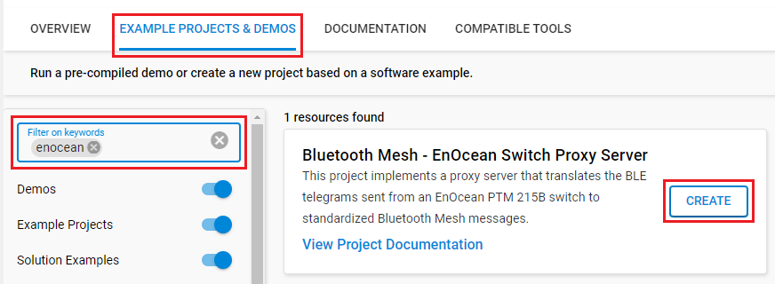
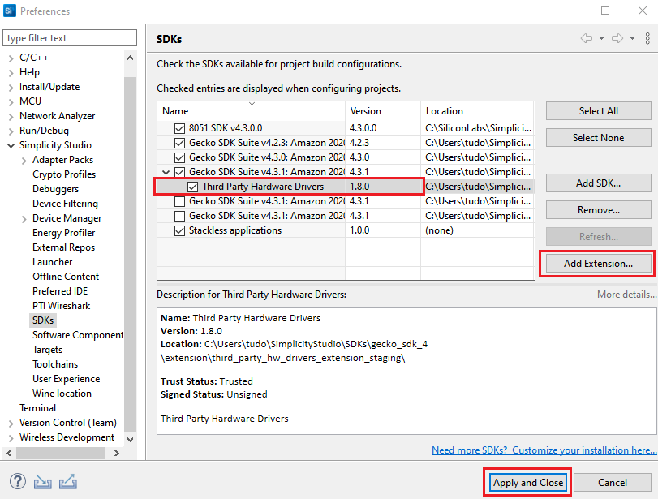

# Bluetooth Mesh - EnOcean Switch Proxy Server #

## Overview ##

This project implements a proxy server that translates the BLE telegrams sent from an EnOcean PTM 215B switch to standardized Bluetooth Mesh messages.

PTM 215B devices contain an electro-dynamic energy converter which is actuated by an energy bow. This bow is pushed by an appropriate push button, switch rocker or a similar construction mounted onto the device. An internal spring will release the energy bow as soon as it is not pushed down anymore.
When the energy bow is pushed down, electrical energy is created and a BLE radio telegram is transmitted, which identifies the action (pressed or not pressed) and the status of the four button contacts. Releasing the energy bow similarly generates energy which is used to transmit a different radio telegram. It is therefore possible to distinguish between radio telegrams sent when the energy bar was pushed and radio telegrams sent when the energy bar was released.
By identifying these different telegram types and measuring the time between pushing and releasing of the energy bar, it is possible to distinguish between “Long” and “Short” button contact presses. This enables simple implementation of applications such as dimming control or blinds control including slat action.

More information about these switches can be found in the manufacturer's user manual here: [EnOcean PTM 215B Bluetooth® Pushbutton Transmitter Module User Manual](https://www.enocean.com/wp-content/uploads/downloads-produkte/en/products/enocean_modules_24ghz_ble/ptm-215b/user-manual-pdf/PTM-215B-User-Manual.pdf).

This proxy server can control both the On/Off state and the level of Bluetooth Mesh devices. When controlling smart lights, for example, shortly pushing the switch button turns the lights on, while holding it for a longer time adjusts the brightness of the lights.

## Gecko SDK Suite version ##

- GSDK v4.3.1
- [Third Party Hardware Drivers v1.7.0](https://github.com/SiliconLabs/third_party_hw_drivers_extension)

## Hardware Required ##

- [Wireless Starter Kit Mainboard](https://www.silabs.com/development-tools/wireless/bluetooth)
- [EFR32xG22 2.4 GHz 6 dBm Radio Board](https://www.silabs.com/development-tools/wireless/slwrb4183a-efr32xg22-wireless-gecko-radio-board)
- [EFR32xG24 Dev Kit](https://www.silabs.com/development-tools/wireless/efr32xg24-dev-kit?tab=overview)
- [PTM 215B Bluetooth® Pushbutton Transmitter Module](https://www.enocean.com/en/product/ptm-215b)

## Connections Required ##

## Setup ##

To test this application, you can either create a project based on an example project or start with a "Bluetooth Mesh - SoC Empty" project based on your hardware.

**NOTE:**

- Make sure that the [Third Party Hardware Drivers](https://github.com/SiliconLabs/third_party_hw_drivers_extension) extension is added to the required SDK. You can go to [Preferences > Simplicity Studio > External Repos](https://docs.silabs.com/simplicity-studio-5-users-guide/latest/ss-5-users-guide-about-the-launcher/welcome-and-device-tabs) to add this extension.

- SDK Extension must be enabled for the project to install the required components.

### Create a project based on an example project ###

1. From the Launcher Home, add your hardware to My Products, click on it, and click on the EXAMPLE PROJECTS & DEMOS tab. Find the example project with the filter **enocean**.

    

2. Click Create button on both Bluetooth Mesh - EnOcean Switch Proxy Server example. Example project creation dialog pops up -> click Create and Finish and the projects will be generated.

3. Build and flash the examples to the board.

### Start with a "Bluetooth Mesh - SoC Empty" project ###

1. Create Bluetooth Mesh - SoC Empty projects for your hardware using Simplicity Studio 5.

2. Copy all attached files in inc and src folders into the project root folder (overwriting existing).

3. Install the software components:
    - Open the .slcp file in the project.
    - Select the SOFTWARE COMPONENTS tab.
    - Install the following components:
        - [Services] → [IO Stream] → [IO Stream: USART] → default instance name: vcom
        - [Driver] → [Button] → [Simple Button] → default instance name: btn0, btn1
        - [Application] → [Utility] → [Button Press]
        - [Bluetooth Mesh] → [Utility] → [Factory Reset]
        - [Third Party Hardware Drivers] → [Services] → [EnOcean Switch Proxy Server]

4. Build and flash the project to your device.

**Note:**

- Make sure the [Third Party Hardware Drivers extension](https://github.com/SiliconLabs/third_party_hw_drivers_extension) is added to the required SDK: [Preferences > Simplicity Studio > SDKs](https://github.com/SiliconLabs/third_party_hw_drivers_extension/blob/master/README.md#how-to-add-to-simplicity-studio-ide).

    

- SDK Extension must be enabled for the project to install components.

- Do not forget to flash a bootloader to your board, see [Bootloader](https://github.com/SiliconLabs/bluetooth_applications/blob/master/README.md#bootloader) for more information.

## How It Works ##

### Usage ###

This section describes how the EnOcean Switch is used in this project, we use it to control the leds on development boards running the **Bluetooth Mesh - SoC Light** example app. However, the switch can be used to control any Bluetooth Mesh device that implements the Generic OnOff Server and/or the Generic Level Server models.

To start using the EnOcean Switch:

1. Build and flash the **EnOcean Switch Proxy Server** project to your device.
2. Build and flash the **Bluetooth Mesh - SoC Light** example to another device (or multiple devices).
3. Provision the devices to a Mesh network.
    - This can be done using the [Silicon Labs Bluetooth Mesh mobile application](https://www.silabs.com/developers/bluetooth-mesh-mobile-app). However, when using the **EnOcean Switch Proxy Server** application, provisioning with the [NCP Commander](https://docs.silabs.com/simplicity-studio-5-users-guide/latest/ss-5-users-guide-tools-bluetooth-ncp-commander) can be more flexible.
4. Bind an EnOcean switch to an element on the proxy server device. This can be done either by
using radio-based commissioning (see section [Commissioning](#commissioning))

### Commissioning ###

EnOcean calls their method of adding switches to a network commissioning. The PTM 215B supports three modes of commissioning, which are:

- NFC-based commissioning
- Camera-based commissioning
- Radio-based commissioning

However, the most convenient method is Radio-based commissioning.

To use radio-based commissioning on the proxy server, it needs to be set into *Commissioning mode*.To do so, press one of the push buttons *(BTN0 or BTN1)* on the development board. After that, the EnOcean switch needs to be placed into radio commissioning mode. This can be done as follows:

1. Start by selecting one button contact on the PTM 215B. Any button *(A0, A1, B0, B1)* can be used.
2. Next, execute the following long-short-long sequence:
3. Press and hold the selected button together with the energy bar for more than 7 seconds before releasing it.
4. Press the selected button together with the energy bar quickly (hold for less than 2 seconds).
5. Press and hold the selected button together with the energy bar again for more than 7 seconds before releasing it.

**Note:** The proxy server will exit the commissioning mode after one minute or after a switch has been commissioned successfully.

### Output ###

After completing all the above guideline, you can control the LED by the switch

