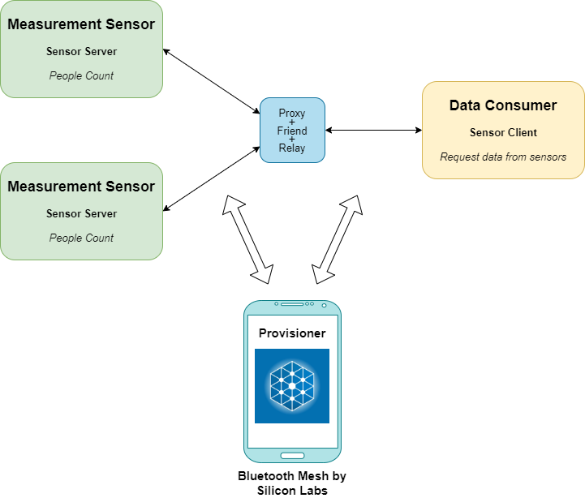
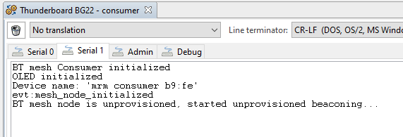
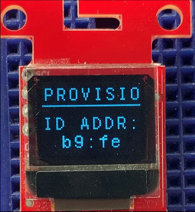
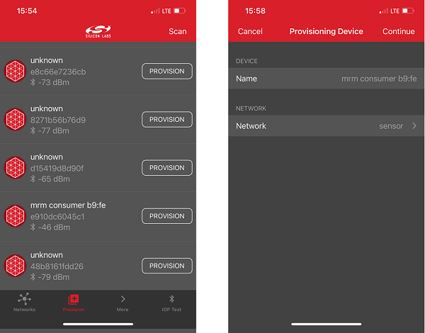
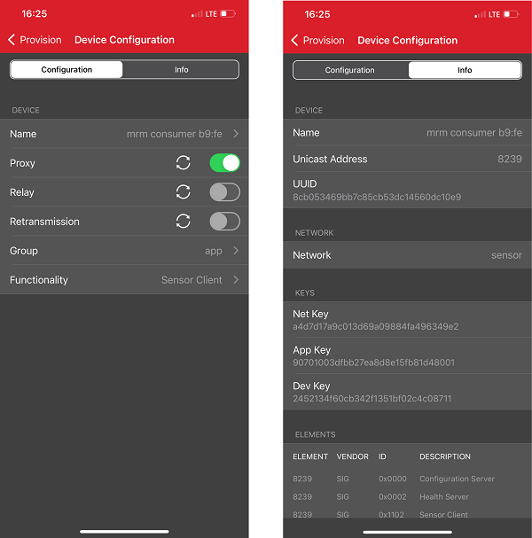
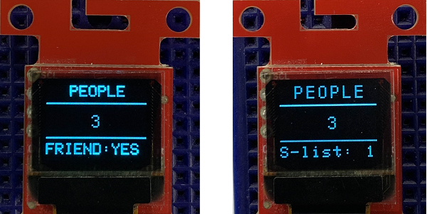

# Mesh Room Monitor application #

## Overview ##

This project aims to implement a room monitoring system using the people counting application, Silabs development kits and external sensors integrated with the Bluetooth Mesh wireless stack.

The block diagram of this application is shown in the image below:

This example project referred to the following code examples. More detailed information can be found here:

- [People counting](https://github.com/SiliconLabs/bluetooth_applications_staging/tree/feature/people_counting/bluetooth_people_counting)

- [Distance sensor driver](https://github.com/SiliconLabs/platform_hardware_drivers/tree/master/distance_vl53l1x)

- [OLED SSD1306 driver](https://github.com/SiliconLabs/platform_hardware_drivers/tree/master/oled_ssd1306_i2c)

- To learn Bluetooth mesh technology basics, see [Bluetooth Mesh Network - An Introduction for Developers.](https://www.bluetooth.com/wp-content/uploads/2019/03/Mesh-Technology-Overview.pdf)

- To learn code-level information on the stack and the common pitfalls to avoid, see: [AN1300: Understanding the Silicon Labs Bluetooth® Mesh Sensor Model Demonstration in SDK v2.x](https://www.silabs.com/documents/public/application-notes/an1300-understanding-bluetooth-mesh-sensor-model-demo-sdk-2x.pdf)

## Gecko SDK Suite version ##

GSDK v4.0.2

## Requirements ##

The following is required to run the demo:

- Two [Thunderboard Sense 2 Sensor-to-Cloud Advanced IoT Kits](https://www.silabs.com/development-tools/thunderboard/thunderboard-sense-two-kit) used for low power sensor nodes (LPN Sensor).

- One [BGM220 Bluetooth Module Explorer Kit](https://www.silabs.com/development-tools/wireless/bluetooth/bgm220-explorer-kit) used for Relay + Friend + Proxy node (R + F + P).

- One [EFR32BG22 Thunderboard Kit](https://www.silabs.com/development-tools/thunderboard/thunderboard-bg22-kit) used for data consumer node.

- Three [SparkFun Micro OLED Breakout (Qwiic) boards](https://www.sparkfun.com/products/14532)

- Two [SparkFun Distance Sensor Breakout boards](https://www.sparkfun.com/products/14722)

- Silicon Labs Bluetooth Mesh Mobile Application (iOS/Android):

  - Used for discovering and provisioning devices.

  - Includes network, group, and publish-subscribe setup.

  - Allows device configuration for the sensor models.

## Getting Started ##

Three applications are required in order to use this demonstration: **Bluetooth Mesh Room Monitor LPN sensor**, **Bluetooth Mesh Room Monitor Consumer** and **Bluetooth Mesh Room Monitor Friend**.

- To get started with Bluetooth Mesh Room Monitor LPN sensor, see: [Bluetooth Mesh Room Monitor LPN sensor.](btmesh_room_monitor_lpn_sensor/README.md)

- To get started with Bluetooth Mesh Room Monitor Consumer, see: [Bluetooth Mesh Room Monitor Consumer.](btmesh_room_monitor_consumer/README.md)

- To get started with Bluetooth Mesh Room Monitor Friend, see: [Bluetooth Mesh Room Monitor Friend.](btmesh_room_monitor_friend/README.md)

## How it works ##

### Mesh Network Implementation ###

The demonstration implementation process can be divided into four main phases:

1. **Unprovisioned mode** – After the demo firmware is installed, the device starts in unprovisioned mode.

2. **Provisioning** – The devices are provisioned to a Bluetooth mesh network and network security is set up.

3. **Configuration** – The group, publish, and subscribe, and application security are configured.

4. **Normal operation** – The sensor server(s) can be controlled by the client(s).

#### Unprovisioned mode ####

In the first phase, all the devices are unprovisioned and transmitting unprovisioned beacons. They do not have any network keys or application keys configured, and publish and subscribe settings are not set. In this state, the devices are simply waiting for the provisioner to assign them into a Bluetooth mesh network, and configure publish and subscribe settings and mesh models. In this state, the devices can be detected by the smartphone application.

Open the serial console in Simplicity Studio for the devices. If you reset the devices, this is what you will observe on the console for the client and server:

And this is what you will see in the device display for the client and server.

Follow the procedures below to set up on your smartphone:

1. Create a Bluetooth mesh network.
2. Select the network and create a group.
3. Go to the provisioning view and search for unprovisioned devices.
4. Select the Bluetooth mesh device you want to provision and configure.

    

#### Provisioning and Configuration ####

In the provisioning phase, the provisioner adds sensor servers and clients to the Bluetooth mesh network. A network key is generated and distributed to the nodes and each node is assigned a unicast address. In the configuration phase, the provisioner configures groups, publish, and subscribe settings; generates application keys; and binds mesh models to application keys.

To provision a Bluetooth mesh device and configure the node:

1. During provisioning select the network you want to add the device to.
2. During configuration select the Bluetooth mesh features (proxy, relay, low power and friend) that you want to enable.
a. Notice that if you disable proxy, the node can no longer be directly accessed over GATT.
3. Select the group you want to add the device to.
4. Finally select the functionality (mesh model) that you want to enable.

    

#### Normal operation ####

After provisioning and configuration, the Bluetooth mesh network is operational, and clients can be used to configure and request data from the sensors.

