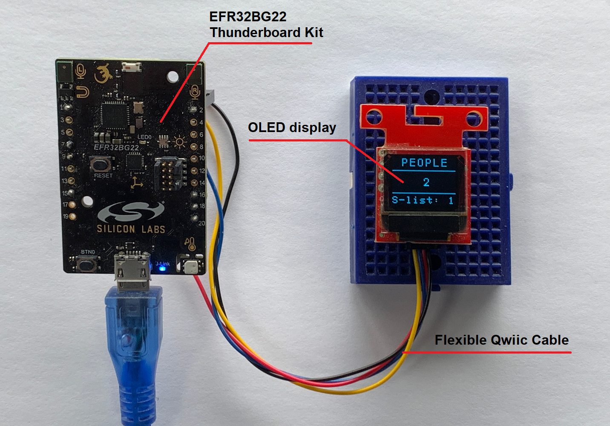
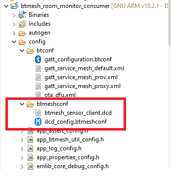
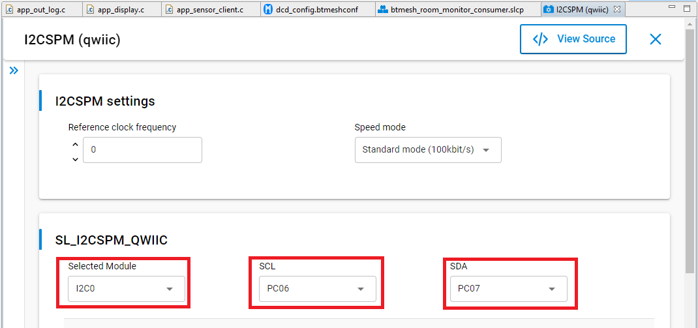
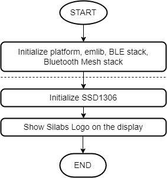
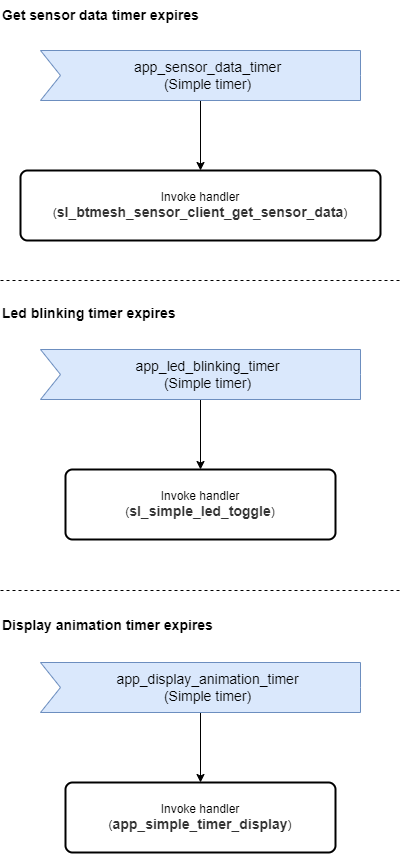
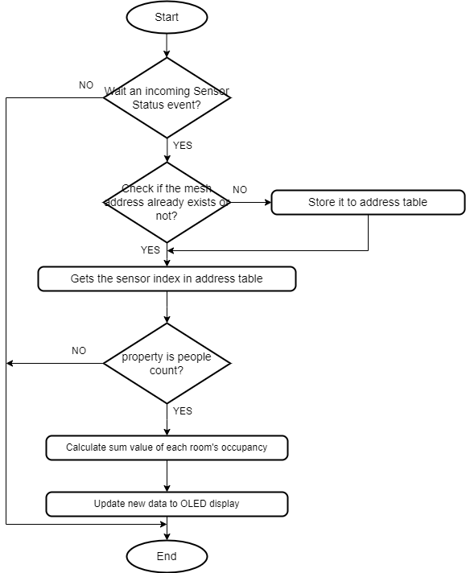
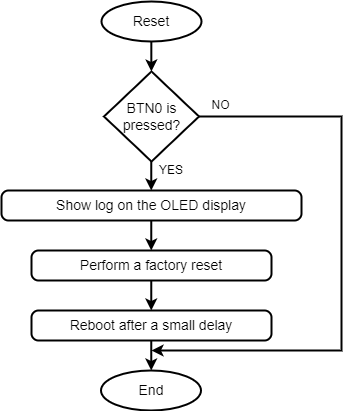
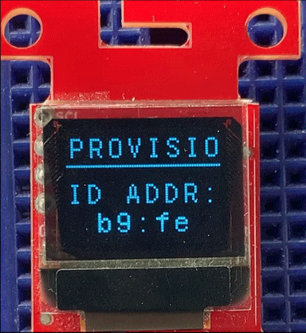
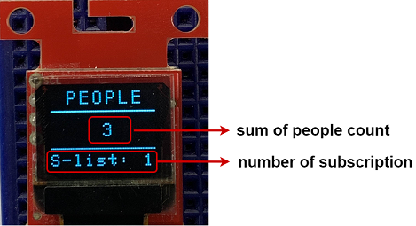
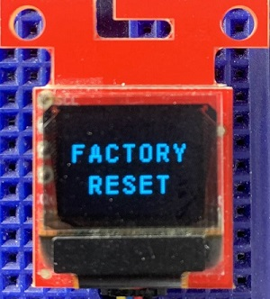

# Bluetooth Mesh Room Monitor Consumer #

## Overview ##

This project aims to implement a room monitoring system using the people counting application, Silicon Laboratories development kits integrated with the Bluetooth Mesh wireless stack.

This code example referred to the following code examples. More detailed information can be found here:

- [OLED SSD1306 driver](https://github.com/SiliconLabs/platform_hardware_drivers/tree/master/oled_ssd1306_i2c)

## Gecko SDK Suite version ##

GSDK v4.0.2

## Hardware Required ##

- [EFR32BG22 Thunderboard Kit](https://www.silabs.com/development-tools/thunderboard/thunderboard-bg22-kit)

- [SparkFun Micro OLED Breakout (Qwiic) board](https://www.sparkfun.com/products/14532)

## Connections Required ##

The hardware connection is shown in the image below:

To connect the EFR32BG22 Thunderboard Kit with the SparkFun Micro OLED Breakout (Qwiic) board we can use some [Flexible Qwiic Cable - Female Jumper](https://www.sparkfun.com/products/17261) as shown in the table below:.

| EFR32BG22 Thunderboard Kit markings |  Qwiic cables color scheme  |
|-------------------------------------|:---------------------------:|
| GND - EXP1                          |  Red - 3.3V                 |
| 3V3 - EXP2                          |  Black - GND                |
| PC6 - EXP7                          |  Yellow - SCL               |
| PC7 - EXP9                          |  Blue - SDA                 |

## Setup ##

To test this application, you can either import the provided `btmesh_room_monitor_consumer.sls` project file or start with an empty example project as the following:

1. Create a **Bluetooth Mesh - SoC Empty** project for the **Thunderboard BG22** using Simplicity Studio 5.

2. Copy all attached files in *inc* and *src* folders into the project root folder (overwriting existing files).

3. Import the Bluetooth Mesh Configuration:

   - Open the .slcp file in the project.

   - Select the **CONFIGURATION TOOLS** tab and open the **Bluetooth Mesh Configurator**.

   - Copy the attached [btmesh_sensor_client.dcd](config/btmesh_sensor_client.dcd) file into the **btmeshconf** folder.

     

   - Save the Bluetooth Mesh configuration (ctrl-s).

4. Open the .slcp file. Select the SOFTWARE COMPONENTS tab and install the software components:

    - Install **[Platform] > [Driver] > [I2CSPM]** component with add new instance name: **qwiic**. Set this component to use I2C0 peripheral, SCL to PC06 pin, SDA to PC07 pin.

        

    - Install **[Platform] > [IO Stream] > [IO Stream: USART]** component with the default instance name: **vcom**.

    - Install **[Platform] > [Driver] > [Button] > [Simple Button]** component with the default instance name: **btn0**.

    - Install **[Platform] > [Driver] > [LED] > [Simple LED]** component with the default instance name: **led0**.

    - Install **[Bluetooth Mesh] > [Stack Classes] > [Sensor Client Model]** component.

    - Install **[Bluetooth Mesh] > [Utility] > [App Utility]** component.

    - Install **[Bluetooth Mesh] > [Utility] > [Event Logging]** component.

    - Install **[Bluetooth Mesh] > [Utility] > [Factory Reset]** component.

    - Install **[Bluetooth Mesh] > [Utility] > [Provisioning Decorator]** component.

5. Build and flash the project to your device.

*Note*: You need to create the bootloader project and flash it to the device before flashing the application. When flash the application image to the device, use the .hex or .s37 output file. Flashing the .bin files may overwrite (erase) the bootloader.

## How it Works ##

### Initialization ###

Application logic initialization function is invoked from the app_init() function at startup.

### Simple timer callbacks ###

- Get sensor data timer expires => 3s

- Led blinking timer expires => 250 ms

- Display animation timer expires => 300 ms

### Application Main Function ###

### Factory reset ###

### Testing ###

Upon reset, the application will display the Silicon Labs logo on the OLED screen for a few seconds.

After the firmware is installed or full factory reset is done, the device starts in unprovisioned mode. In this state, the device is simply waiting for the provisioner to assign them into a Bluetooth mesh network, and configure publish and subscribe settings and mesh models.

After the device is already provisioned and publish-subscribe settings have been configured by the smartphone app, the application starts a timer to periodically request people count data from the sensor servers. The application also subscribes for the messages that are published on the mesh network and calculate the sum value of each room's occupancy.

This calculated value displayed on an OLED display as shown below.

**Note:**

- To provision the device, follow [these procedures.](../README.md)

- To full factory reset, button PB0 should be pressed during startup (power-on or reset), then the message "Factory reset" should appear on the OLED screen as shown below.

