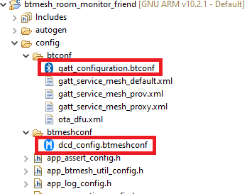

# Relay + Friend + Proxy node

## Overview

This project aims to implement a relay + friend + proxy node in the room monitoring network, that using the Silabs development kits with the Bluetooth Mesh wireless stack.

More detailed information can be found in the section [How it works](#how-it-works).

## Gecko SDK Suite version

GSDK v4.0.2

## Hardware Required

- A [BGM220 Bluetooth Module Explorer Kit](https://www.silabs.com/development-tools/wireless/bluetooth/bgm220-explorer-kit) for relay + friend + proxy node (R + F + P)

## Software Required

- You need the Silicon Labs Bluetooth Mesh smartphone application available on [iOS](https://apps.apple.com/us/app/bluetooth-mesh-by-silicon-labs/id1411352948) and [Android](https://play.google.com/store/apps/details?id=com.siliconlabs.bluetoothmesh) installed on the smartphone.

## Setup

You can either import the provided `btmesh_room_monitor_friend.slcp` project file or start with an example project as the following:

1. Create a **Bluetooth Mesh - SoC Empty** project for **BGM220PC22HNA** module using Simplicity Studio 5.
2. Copy all attached files in *inc* and *src* folders into the project root folder (overwriting existing app.c).
3. Copy the attached [dcd_config.btmeshconf](config/dcd_config.btmeshconf) file into the **config/btmeshconf** folder.
4. Copy the attached [gatt_configuration.btconf](config/gatt_configuration.btconf) file into the **config/btconf** folder.

      

5. Open the .slcp file. Select the SOFTWARE COMPONENTS tab and install the software components:
    - Install **[Service] > [IO Stream] > [IO Stream: USART]** with instance name **vcom** and configure:
        - **Selected Module** is USART1
        - **USART settings > Flow control**: None
        - **RX**: PA06
        - **TX**: PA05
    - Install **[Application] > [Utility] > [Log]**.
    - Install **[Platform] > [Driver] > [Button] > [Simple Button]** with instance name: **btn0** and configure  **Selected Module** is PC07.
    - Install **[Platform] > [Driver] > [LED] > [Simple LED]** with instance name: **led0** and configure  **Selected Module** is PA04.
    - Install **[Bluetooth Mesh] > [Utility] > [Factory Reset]**.
    - Install **[Bluetooth Mesh] > [Features] > [Friend]**.
    - Install **[Bluetooth Mesh] > [Features] > [Proxy]**.
    - Install **[Bluetooth Mesh] > [Features] > [Relay]**.
    - Install **[Bluetooth Mesh] > [Utility] > [Provisioning Decorator]**.
    - Configure **[Bluetooth Mesh] > [Bluetooth Mesh Stack] > [Maximum number of Friendships allowed]** is 4
        

6. Build and flash the project to your device.

*Note*: You need to create the bootloader project and flash it to the device before flashing the application. When flash the application image to the device, use the .hex or .s37 output file. Flashing the .bin files may overwrite (erase) the bootloader.

## How it works

### Bluetooth mesh node initialization

This node aims to implement proxy, relay and friend feature of bluetooth mesh

### Button

Factory reset the node by pressing and releasing the reset button on the mainboard while pressing BTN0 in 3 seconds. The LED0 on the mainboard blinks every 1 second indicating that the node is unprovisioned.

### LED

LED0 on the main board may have the following states:

- Blinking every 1 second indicating that the node is unprovisioned.
- Blinking every 250 microseconds indicating that the node is being provisioned.
- ON when have connection between the friend node and low power node, and OFF when the connection is lost.

### Provisioning procedure

See [Provisioning a Bluetooth Mesh Network Part 1](https://www.bluetooth.com/blog/provisioning-a-bluetooth-mesh-network-part-1/) and [Provisioning a Bluetooth Mesh Network Part 2](https://www.bluetooth.com/blog/provisioning-a-bluetooth-mesh-network-part-2/) to learn more about provisioning procedure.
