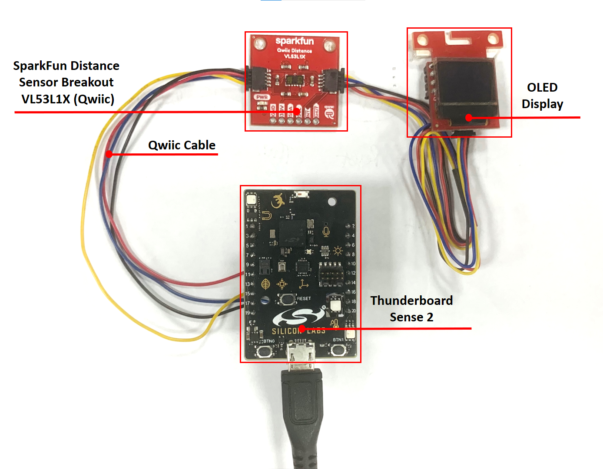
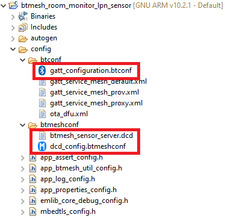
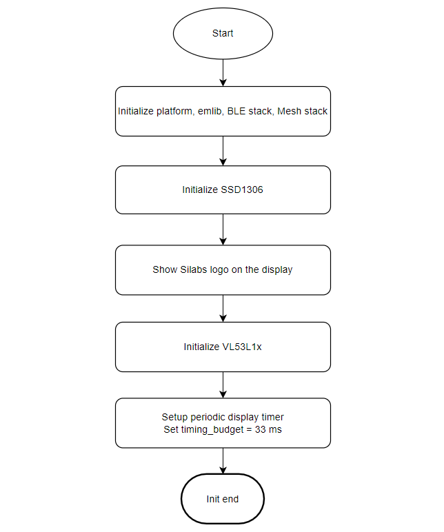
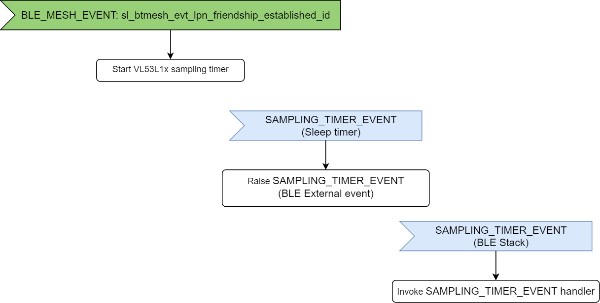
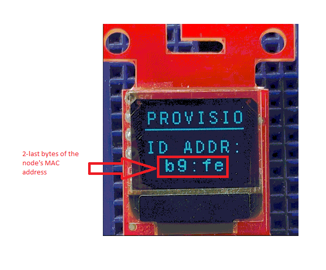
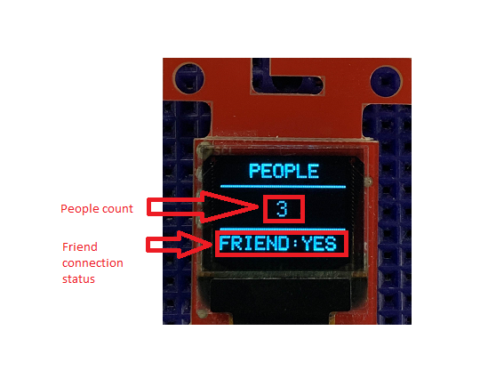

# LPN sensor server

## Overview

This project aims to implement a lpn people counting sensor node in the room monitoring network, that using the people counting application, Silabs development kits and external sensors integrated with the Bluetooth Mesh wireless stack.

More detailed information can be found in the section [How it works](#how-it-works).

This code example referred to the following code examples. More detailed information can be found here:

- [People counting](https://github.com/SiliconLabs/bluetooth_applications_staging/tree/feature/people_counting/bluetooth_people_counting)

- [Distance sensor driver](https://github.com/SiliconLabs/platform_hardware_drivers/tree/master/distance_vl53l1x)

- [OLED SSD1306 driver](https://github.com/SiliconLabs/platform_hardware_drivers/tree/master/oled_ssd1306_i2c)

## Gecko SDK Suite version

GSDK v4.0.2

## Hardware Required

- A [Thunderboard Sense 2 Sensor-to-Cloud Advanced IoT Kits](https://www.silabs.com/development-tools/thunderboard/thunderboard-sense-two-kit) for low power sensor nodes (LPN Sensor).
- A [SparkFun Micro OLED Breakout (Qwiic) board](https://www.sparkfun.com/products/14532)
- A [SparkFun Distance Sensor Breakout](https://www.sparkfun.com/products/14722)
- An iOS or Android smartphone if you decide to provision using the Bluetooth mesh by Silicon Labs mobile application.

## Software Required

- You need the Silicon Labs Bluetooth Mesh smartphone application available on [iOS](https://apps.apple.com/us/app/bluetooth-mesh-by-silicon-labs/id1411352948) and [Android](https://play.google.com/store/apps/details?id=com.siliconlabs.bluetoothmesh) installed on the smartphone.

## Connections Required

Hardware connection of LPN Sensor node is shown in the image below:

To connect the Thunderboard with the SparkFun Distance Sensor Breakout VL53L1X (Qwiic) board we can use some [Flexible Qwiic Cable - Female Jumper (4-pin)](https://www.sparkfun.com/products/17261) as shown in the table below:

| Thunderboard Sense Pins     |  SparkFun Distance Sensor Breakout VL53L1X Pins |
|-----------------------------|:-----------------------------------------------:|
| EXP HEADER PIN 20  - 3V3    |  3V3 - RED JUMPER                               |
| EXP HEADER PIN 1 - GND      |  GND - BLACK JUMPER                             |
| EXP HEADER PIN 15 - SCL     |  SCL - YELLOW JUMPER                            |
| EXP HEADER PIN 16 - SDA     |  SDA - BLUE JUMPER                              |

To connect SparkFun Distance Sensor Breakout VL53L1X (Qwiic) board with SparkFun Micro OLED Breakout (Qwiic) board we can use [Qwiic Cable](https://www.sparkfun.com/products/14427).

## Setup

You can either import the provided `btmesh_room_monitor_lpn_sensor.slcp` project file or start with an example project as the following:

1. Create a **Bluetooth Mesh - SoC Empty** project for Thunderboard sense 2 board using Simplicity Studio 5.
2. Copy all attached files in *inc* and *src* folders into the project root folder (overwriting existing app.c).
3. Copy the attached [btmesh_sensor_server.dcd](config/btmesh_sensor_server.dcd) file into the **config/btmeshconf** folder.
4. Copy the attached [dcd_config.btmeshconf](config/dcd_config.btmeshconf) file into the **config/btmeshconf** folder.  
5. Copy the attached [gatt_configuration.btconf](config/gatt_configuration.btconf) file into the **config/btconf** folder.  
  

6. Open the .slcp file. Select the SOFTWARE COMPONENTS tab and install the software components:
    - Install **[Service] > [IO Stream] > [IO Stream: USART]**.
    - Install **[Application] > [Utility] > [Log]**.
    - Install **[Platform] > [Driver] > [Button] > [Simple Button]** with add instance name: **btn0**.
    - Install **[Platform] > [Driver] > [I2C] > [I2CSPM]** with instance name: **qwiic** and configure  **Selected Module** is **I2C0**, **SCL** is **PC11**, **SDA** is **PC10**.
    - Install **[Platform] > [Driver] > [LED] > [Simple LED]** with add instance name: **led0**.
    - Install **[Bluetooth Mesh] > [Utility] > [Factory Reset]**.
    - Install **[Bluetooth Mesh] > [Features] > [Low Power Node]**.
    - Install **[Bluetooth Mesh] > [Features] > [Proxy]**.
    - Install **[Bluetooth Mesh] > [Utility] > [Provisioning Decorator]**.
    - Install **[Bluetooth Mesh] > [Models] > [Sensors] > [Sensor Server]**.
    - Install **[Bluetooth Mesh] > [Utility] > [People Count Sensor]**.

7. Build and flash the project to your device.

## How it works

### LPN Sensor initialization

Please refer [People counting application](https://github.com/SiliconLabs/bluetooth_applications_staging/tree/feature/people_counting/bluetooth_people_counting) for information related to sensor like sampling, counting algorithm.

### Runtime event

### OLED Display

#### Unprovisioned screen

The OLED displays the 2-last bytes of the node's MAC address
  

#### Provisioned screen

The OLED displays the number of people, that counted by the node. It also displays the connection status of node and friend node. If it show "YES" then the connection with the friend node is established, if it show "NO" then the connection with the friend node is teminated or failed

### Button

Factory reset the node by pressing and releasing the reset button on the mainboard while pressing BTN0 in 3 seconds. The LED0 on the mainboard blinks every 1 second indicating that the node is unprovisioned.

### LED

LED0 on the main board may have the following states:

- Blinking every 1 second indicating that the node is unprovisioned.
- Blinking every 250 microseconds indicating that the node is being provisioned.
- ON when have connection between the friend node and low power node, and OFF when the connection is lost.

### Provisioning procedure

See [Provisioning a Bluetooth Mesh Network Part 1](https://www.bluetooth.com/blog/provisioning-a-bluetooth-mesh-network-part-1/) and [Provisioning a Bluetooth Mesh Network Part 2](https://www.bluetooth.com/blog/provisioning-a-bluetooth-mesh-network-part-2/) to learn more about provisioning procedure.
