# btmesh_data_log #

## Summary ##

This demo shows how to use Silicon Labs Bluetooth Mesh Vendor Model to send data between nodes in Mesh network.

## Gecko SDK version ##

Bluetooth SDK 3.1.2, Bluetooth Mesh 2.0.2

## Hardware Required ##

Wireless STK Mainboard and EFR32xG21 Radio Board. 

## Connections Required ##

At least one node for Log Server, one node for Log client and a provisioner.

## Setup ##

- In Bluetooth Mesh Configurator: add vendor model to the main element.
		For the server model ID should be 0x02ff 0x0000.
		For the client model ID should be 0x02ff 0x0001.

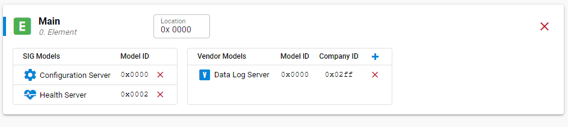

- Use a provisioner to provision for Client and Server.
- On provisioner, create two groups: Server_Group (address: 0xC000) and Client_Group (address: 0xC001).
		Set publication address for the Server to Server_Group and subscription address to Client_Group.
		Set publication address for the Client to Client_Group and subscription address to Server_Group.
	
## How It Works ##

- The Log server periodically gets sample data and saves to the local log. After an amount of configured time, Log server sends the entire saved data to the Log client.
After the Log Server and Client nodes are provisioned and added to groups, user could press button0 on Server node to start the log (start to sample data and periodic report logged data to client).
On the client node, the received log will be printed to CLI console. After server provisioned, the sample rate and log period value are the default values that are defined in the sl_btmesh_data_logging_config.h file.
The client could set the pre-compiled timing for data sample (set sample rate) and log report period (set period) by pressing button0 to set sample rate and pressing button1 to set period.

- A software component is implemented that uses Vendor model APIs to send/receive log.

## .sls Projects Used ##

- soc_btmesh_data_logging_server_xg21.sls
- soc_btmesh_data_logging_client_xg21.sls

Toolchain: GNU ARM v10.2.1

## How to Port to Another Part ##

You will get a Data Log example for Wireless STK Mainboard + EFR32xG21 Radio Board as the starting point, which is created from Simplicity Studio based on the SOC-Empty example in the Bluetooth Mesh SDK. The project is called soc_btmesh_data_logging_server_xg21.sls/soc_btmesh_data_logging_client_xg21.sls. Follow below steps to import it to your Simplicity Studio.

1)   Open Simplicity Studio, then click [File] -> [Import], 

2)   Choose soc_btmesh_data_logging_server_xg21.sls/soc_btmesh_data_logging_client_xg21.sls

3)   The project is imported to your IDE

To create project for the other EFR32 devices, do the following steps:

1)   Create two SOC-Empty examples for server/client node and name it accordingly (Ex: "soc_btmesh_data_logging_server", "soc_btmesh_data_logging_client").

2)   Open configurator and install following software components for both server and client node:
    - Application->Service->Simple timer service

    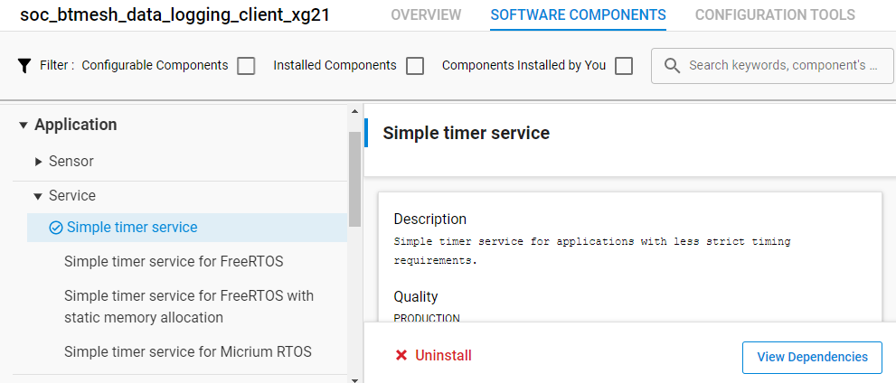

    - Application->Utility->Assert
    - Application->Utility->Log

    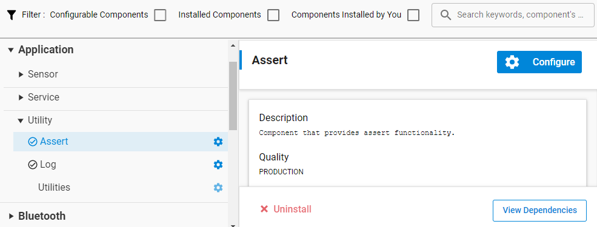

    - Bluetooth Mesh->Features->Proxy
    - Bluetooth Mesh->Features->Relay

    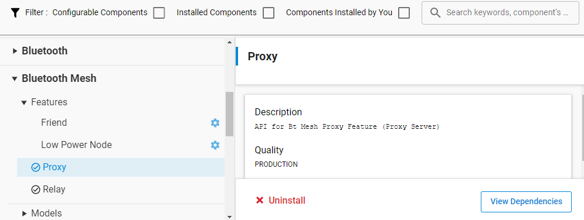

    - Bluetooth Mesh->Stack Classes->GATT Provisioning Bearer
    - Bluetooth Mesh->Stack Classes->Vendor Model

    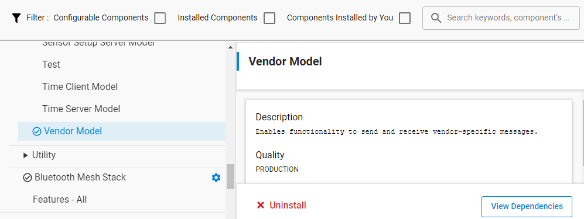

    - Bluetooth Mesh->Utility->App Utility
    - Bluetooth Mesh->Utility->Button Press
    - Bluetooth Mesh->Utility->Factory Reset
    - Bluetooth Mesh->Utility->Provisioning Decorator

    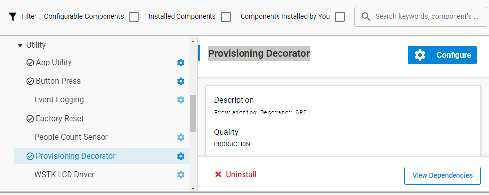

    - Platform->Driver->Simple Button Core
    - Platform->Driver->Simple LED Core
    
    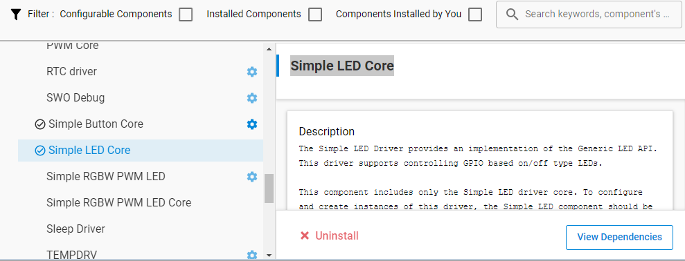

    - Add new instance for btn1 and led1.

    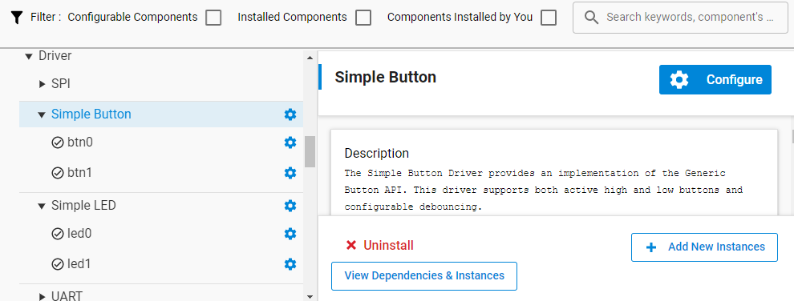

    - Services->NVM3->NVM3 Core
    - Services->NVM3->NVM3 Default Instance

    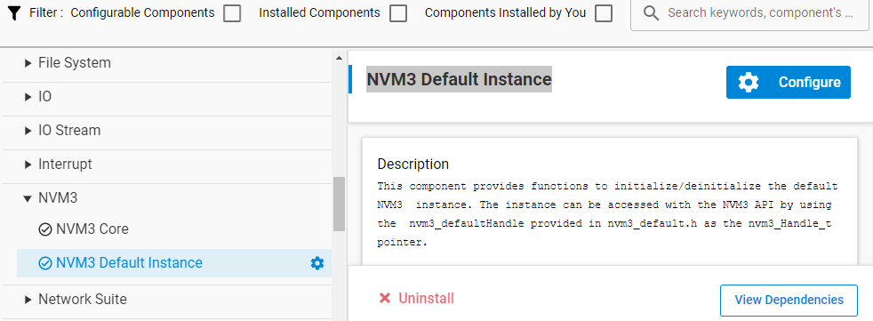

    With the server node, if the board has the Si70xx - Temperature/Humidity Sensor presented you can install Si70xx component get temperature/humidity as logging data.

    - Platform->Board Drivers->Si70xx - Temperature/Humidity Sensor

    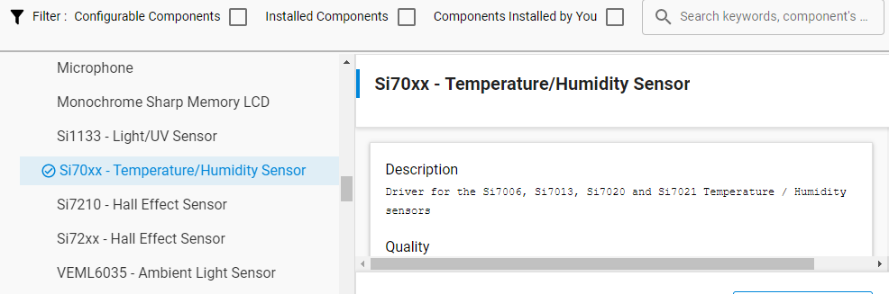

    - Platform->Driver->I2CSPM  with instance name as "temperature_env"

    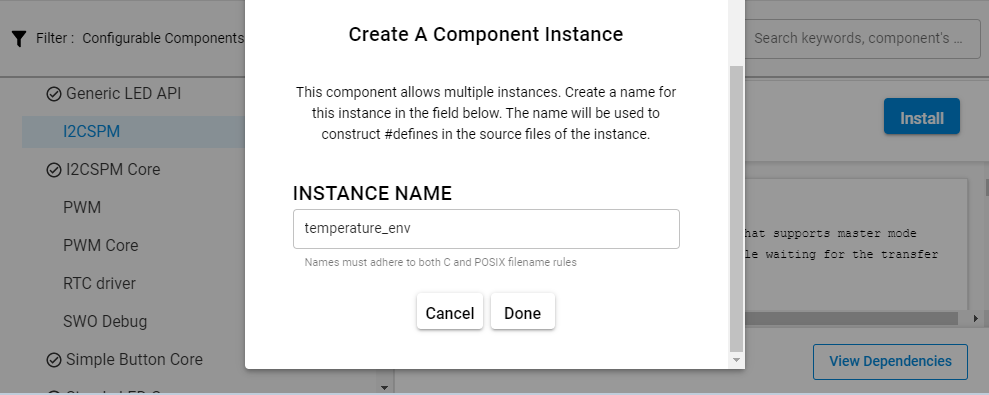

3)   Copy source files to created projects.
- Server node:
  > src/sl_btmesh_data_logging_capi.c
  
  > src/sl_btmesh_data_logging_server.c
  
  > inc/sl_btmesh_data_logging_capi.h
  
  > inc/sl_btmesh_data_logging_config.h
  
  > inc/sl_btmesh_data_logging_server.h
  
  > temperature/src/sl_btmesh_temperature.c
  
  > temperature/inc/sl_btmesh_temperature.h
  
  > temperature/inc/sl_btmesh_temperature_config.h
  
  > Copy all contains of the src/app_server.c to app.c on server project.
  
- Client node:
  > src/sl_btmesh_data_logging_capi.c
  
  > src/sl_btmesh_data_logging_client.c
  
  > inc/sl_btmesh_data_logging_capi.h
  
  > inc/sl_btmesh_data_logging_config.h
  
  > inc/sl_btmesh_data_logging_client.h
  
  > Copy all contains of the src/app_client.c to app.c on client project.

    If board has Si70xx sensor available then un-comments the line which contains macro 

"#define SL_BTMESH_TEMPERATURE_SI70XX_PRESENT" in the sl_btmesh_temperature_config.h file.

## Special Notes ##

The current implementation supports one vendor model that is added on main element only.

This application example just uses simple data type int8_t for the log. User can modify to log for the different data types (Ex. temperature, humidity...).
